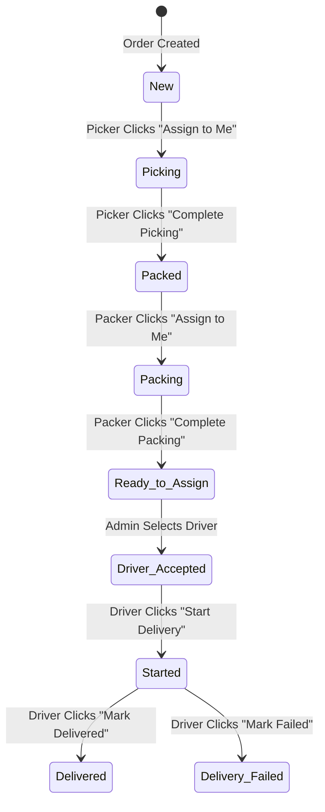

# HalaMama Admin Dashboard & RouteMyOrder (RMO)
## Comprehensive Technical & Business System Documentation

---

## 1. Executive Summary

* **Project Name**: HalaMama Last Mile Delivery (LMD) Platform & RouteMyOrder (RMO) Mobile App
* **Project Purpose**: To digitize, automate, and streamline the end-to-end warehouse picking, packing, delivery, and installation workflows for HalaMama. It serves as an operational bridge between backend sales platforms (Shopify/ERPNext) and frontline operations.
* **Key Features**:
  * Dual-application design (Desktop Admin Dashboard + Mobile-first Field App).
  * Real-time role-based operational dispatch (Pickers, Packers, Drivers).
  * Interactive live pipeline tracker and visual Doha delivery map.
  * Cross-tab synchronization bridge for simulated mock environments and full REST support for live ERPNext backends.
  * Embedded product installation scheduling and returns processing modules.
  * Export terminal for granular operational performance metrics.
* **Target Users**:
  * **Warehouse Managers / Dispatchers**: Monitor performance, assign roles, process returns, schedule installations.
  * **Pickers**: Pick items from warehouse shelves, flag discrepancies, and schedule product installations.
  * **Packers**: Seal picked items into physical bags and label packages.
  * **Drivers**: Navigate routes, accept assignments, collect payments, and log delivery statuses.
  * **Executives / Clients**: High-level KPIs, operational reports, and strategic bottleneck analysis.
* **Business Value**: Eliminates paper dispatch sheets, reduces picking errors, accelerates delivery times, registers payment methods at point-of-delivery, and ensures high-value items requiring specialized assembly are routed immediately to scheduled installers.
* **High-Level Workflow**:
  ```
  [Shopify/ERPNext Sales Order] 
             ↓
    [Admin Dashboard: New] 
             ↓
     [RMO App: Picker] ──(Flag/Schedule)──> [Admin: Scheduled Installations]
             ↓ (Picked)
     [RMO App: Packer] ──(Bag Count)
             ↓ (Packed)
  [Admin Dashboard: Dispatch] ──(Assign Driver)
             ↓
     [RMO App: Driver] ──(Start Navigation) ──> [Delivered / Failed]
  ```

---

## 2. Project Overview

The HalaMama platform handles the transition of an order from a digital sales transaction to a physically delivered and installed product. 

### Main Modules
1. **Fulfillment & Dispatch Module (Admin)**: Allows administrative users to manage orders, see picking/packing progress, and assign drivers.
2. **Returns and Refunds Module (Admin)**: Processes returned items, logs reasons, and updates inventory/restock locations.
3. **Scheduled Installations Module (Admin)**: Holds products flagged by pickers as needing installer routing, facilitating bulk driver assignment.
4. **Operations Portal (RMO Mobile App)**: Handheld user interfaces for Pickers, Packers, and Drivers.
5. **Warehouse Terminal & Reports (Admin)**: Generates performance files for warehouse productivity auditing.

### Main Actors/Users
* **Warehouse Manager (Admin)**: Oversees KPIs, handles exceptions, assigns drivers, processes returns, manages warehouses, and exports performance data.
* **Picker**: Operates on the warehouse floor checking off items, marking them picked, or scheduling complex products.
* **Packer**: Finalizes items into physical bags, recording bag counts.
* **Driver / Installer**: Delivers packages to destination addresses and performs product installations.

---

## 3. System Architecture

The ecosystem uses a decoupled, modern frontend layer that can connect to either a mock database or a live ERPNext endpoint.

```
       +---------------------------------------------+
       |             Client Browser / Mobile         |
       |                                             |
       |  +-------------------+  +----------------+  |
       |  |  Admin Dashboard  |  | RMO Mobile App |  |
       |  +---------+---------+  +--------+-------+  |
       +------------|---------------------|----------+
                    |                     |
                    +----------+----------+
                               |
                               ▼
                    +--------------------+
                    |  API Router / Env  |
                    | (isDemoMode Check) |
                    +----------+---------+
                               |
            +------------------+------------------+
            | VITE_USE_MOCK_DATA=true             | VITE_USE_MOCK_DATA=false
            ▼                                     ▼
   +------------------+                  +------------------+
   |   localStorage   |                  |  ERPNext Server  |
   |   Shared Store   |                  |    REST APIs     |
   | (sync.ts Bridge) |                  +------------------+
   +------------------+
```

* **Frontend Architecture**: React-based. The Admin Dashboard uses TypeScript, TanStack Router (file-based routing), and React Query. The RMO Mobile App uses JavaScript and React Router.
* **Backend / Database Architecture (Demo Mode)**: Uses `localStorage` as a unified database. Cross-app events are updated in real-time across tabs using window-level `'storage'` events.
* **Backend Architecture (Live Mode)**: Communicates with the ERPNext server via its REST API (authenticated with API keys and secrets).
* **Authentication**: Token-based header authentication in Live Mode. Pre-seeded local user profiles and credentials in Demo Mode.

---

## 4. Database Analysis

In **Demo Mode**, the database consists of key-value stores serialized in the client's `localStorage`. In **Live Mode**, these correspond directly to ERPNext Doctype schemas.

### Key Store 1: `hm_shared_orders` (Sales Order Doctype)
* **Purpose**: Tracks order details, status, items, assignments, and shipping details.
* **Key Fields**:
  * `id` (String / Name): The unique order identifier (e.g., `HM64110`).
  * `customer` (String / Customer): Name of the customer.
  * `address` (String / Address): Physical shipping location.
  * `phone` (String): Contact phone number.
  * `total` (Float / Grand Total): Total transaction price.
  * `status` (String): The active lifecycle state.
  * `picker` (String / custom_picker): Assigned picker email.
  * `packer` (String / custom_packer): Assigned packer email.
  * `driver` (String / custom_driver): Assigned driver email.
  * `bags` (Integer / custom_bags): Total package bags.
  * `items` (Array of objects / Sales Order Item): Contains `sku`, `name`, `qty`, `picked`.

### Key Store 2: `hm_scheduled_installations` (Custom Doctype / Scheduled Installations)
* **Purpose**: Holds items flagged by pickers requiring installation.
* **Key Fields**:
  * `id` (String): Generated installation ID.
  * `orderId` (String): Parent order reference.
  * `productName` (String): Name of item.
  * `sku` (String): Item barcode identifier.
  * `customerName` (String): Customer name.
  * `status` (String): `Pending` or `Assigned`.
  * `scheduledAt` (ISO DateTime string): Timestamp when scheduled.
  * `assignedDriver` (String): Installer driver name.

### Key Store 3: `hm_managed_users` (User Doctype)
* **Purpose**: Stores staff profiles created via the Admin panel.
* **Key Fields**: `id`, `name`, `email`, `role`, `password`.

---

## 5. API Analysis

The system invokes these core endpoints. Under Demo Mode, these map to delay-simulated local store functions in `src/lib/api/services.ts` (Admin) and `route-my-order/src/api/orders.js` (RMO).

### 1. Fetch Orders
* **Endpoint**: `GET /api/resource/Sales Order`
* **Payload**: Filters for role assignment, status fields.
* **Trigger**: Page mount, interval refreshes, or sync events.
* **Response**: Array of orders matching active role (Picker gets all, Packer gets packed/packing, Driver gets assigned).

### 2. Assign Order
* **Endpoint**: `PUT /api/resource/Sales Order/${id}`
* **Request Payload**: `{ custom_picker: email, custom_picking_status: "In Progress" }` (or packer/driver fields).
* **Trigger**: Click "Assign to Me" or select driver from dashboard dropdown.

### 3. Update Item Status
* **Endpoint**: `PUT /api/resource/Sales Order Item/${sku}`
* **Request Payload**: `{ custom_status: "Picked" }`
* **Trigger**: Toggling item check-off in RMO Picker details.

### 4. Complete Picking / Packing / Delivery
* **Endpoints**: `PUT /api/resource/Sales Order/${id}`
* **Payloads**:
  * *Picking*: `{ status: "Packed", custom_picking_status: "Completed", custom_picker: email }`
  * *Packing*: `{ custom_bags: bags, custom_packing_status: "Completed", status: "Ready to Assign", custom_packer: email }`
  * *Delivery*: `{ status: "Completed", delivery_status: "Delivered", payment_method: method }`
  * *Failure*: `{ status: "Delivery Failed", custom_failure_reason: reason }`

---

## 6. Complete User Workflow (RMO App)

```
Login Screen ──> Select Role Dashboard 
                       │
     +-----------------+-----------------+
     ▼                 ▼                 ▼
[Picker Flow]     [Packer Flow]     [Driver Flow]
Browse New        Browse Packed     Browse Assigned
     │                 │                 │
Assign to Me      Assign to Me      Start Trip
     │                 │                 │
Check off Items   Count Bags        Navigate
     │                 │                 │
Complete Pick     Complete Pack     Deliver/Fail
```

* **Step 1: Authenticate**: User inputs email and password. App routes based on role.
* **Step 2 (Picker)**: Selects a `New` order $\rightarrow$ clicks **Assign to Me** $\rightarrow$ checks off SKUs (or flags issues / schedules installations) $\rightarrow$ clicks **Complete Picking**.
* **Step 3 (Packer)**: Selects a picked order $\rightarrow$ inputs bag count $\rightarrow$ clicks **Complete Packing**.
* **Step 4 (Driver)**: Accepts assignment $\rightarrow$ clicks **Start Delivery** $\rightarrow$ navigates $\rightarrow$ records delivery success (with payment) or logs failure.

---

## 7. Complete Admin Workflow

```
Dashboard Overview (KPIs, Active Pipeline Tracker, Dispatch Map)
  │
  ├─> Order List ──> Order Details
  │                    ├─> Assign Driver
  │                    ├─> Process Returns (Qty, Reason, Shelf Restock)
  │                    └─> View Audit Timeline
  │
  ├─> Scheduled Installations ──> Bulk Assign Installers
  │
  ├─> User Management ──> Create/Edit staff (Picker/Packer/Driver)
  │
  └─> Export Terminal ──> Generate and download CSV logs
```

* **Monitoring**: Dispatchers review live pipeline status counters.
* **Driver Dispatch**: Selects packed orders and updates drivers using the inline selectors.
* **Installation Routing**: Reviews complex assemblies and schedules installers in bulk.
* **Returns Processing**: Processes returns at the warehouse desk, updating stocks and timeline records.
* **Staff Controls**: Registers, updates, or revokes staff user credentials.

---

## 8. Screen-by-Screen Analysis

### Page 1: Login Screen (RMO App & Admin)
* **Purpose**: Access control.
* **Users**: All actors.
* **Buttons & Actions**: "Login" (validates fields, runs auth resolver, sets storage tokens, redirects to dashboard).

### Page 2: Admin Dashboard Page (`/`)
* **Purpose**: Operation visualization.
* **Users**: Managers, executives.
* **Buttons**:
  * *Time Filter*: Changes KPI scopes (Today, Yesterday, 7D, 30D).
  * *Pipeline Tracker Stages*: Click a stage (e.g. "Ready to Assign") to filter the list.
* **Business Logic**: Aggregates total sales, active counts, and displays active driver nodes on a canvas map.

### Page 3: Order Details Page (`/orders/$orderId`)
* **Purpose**: Order administration.
* **Users**: Warehouse Managers.
* **Buttons & Controls**:
  * *Driver Dropdown*: Assigns a driver. Updates order state immediately.
  * *Return Item Details*: Triggers return processing.
  * *Process Return Button*: Validates return quantity, reason, and updates order timeline.

### Page 4: Scheduled Installations Page (`/scheduled`)
* **Purpose**: Managing installation queues.
* **Users**: Administrators.
* **Buttons**:
  * *Bulk checkboxes*: Select multiple products.
  * *Assign Driver Dropdown*: Links installer driver to all selected items.
  * *Remove from Schedule*: Deletes entry, returning it to picker workflow.

---

## 9. Function-by-Function Analysis

### 1. `initSync`
* **Location**: `src/lib/sync.ts` & `route-my-order/src/api/sync.js`
* **Purpose**: Set up reactive updates between apps in Demo Mode.
* **Business Logic**: Attaches a listener to the browser `storage` window event. When data modifications trigger updates, it invokes callback hooks to refetch page state.
* **Called By**: App bootstrap / dashboard entry points.

### 2. `scheduleItem`
* **Location**: `src/lib/scheduled-installations.ts`
* **Purpose**: Moves an item from warehouse picking to scheduled installer list.
* **Business Logic**: Instantiates a new `ScheduledItem` object, pushes it to `hm_scheduled_installations` store, and triggers a sync broadcast.

### 3. `assignDriver`
* **Location**: `src/lib/api/services.ts` / `orders.js`
* **Purpose**: Links a driver to an order.
* **Business Logic**: Updates `assignedTo` field to driver's email, changes status to `Driver Accepted`, and broadcasts updates.

---

## 10. Button Click Behaviour Analysis

### A. "Process Return" Button
* **Location**: Order Details Return Card.
* **Visible To**: Admin/Manager.
* **What Happens**:
  1. Validates that return quantity $\le$ order item quantity.
  2. Creates a return log in the order data payload.
  3. Updates subtotal and grand total.
  4. Appends a "Return processed" event to the order timeline.
  5. Refreshes the details page view.

### B. "Complete Picking" Button
* **Location**: Picker Details (bottom sticky action).
* **Visible To**: Logged-in Picker.
* **What Happens**:
  1. Checks if all items are either checked `Picked` or set as `Scheduled`.
  2. Updates order status from `picking` to `packed`.
  3. Resets `assignedTo` to null (making it available for packing).
  4. Appends picker's email/name to fulfillment history.

---

## 11. Order Management Deep Dive

### Order Lifecycle States & Triggers



1. **New**:
   * *Trigger*: Shopify sales event.
   * *Updates*: Added to fulfillment pool.
2. **Picking**:
   * *Trigger*: Picker assignment click.
   * *Updates*: Assigned picker name stored. Status badge changes to purple.
3. **Packed**:
   * *Trigger*: All items verified by Picker.
   * *Updates*: Order is flagged ready for boxing/packing.
4. **Ready to Assign**:
   * *Trigger*: Packing completed.
   * *Updates*: Bag counts and packer details logged. Moves to dispatcher view.
5. **Delivered**:
   * *Trigger*: Driver completes physical handoff.
   * *Updates*: Status marked Completed. Payment method finalized.

---

## 12. User Journey Mapping

### Customer Journey
```
Order Placed ──> Receives WhatsApp/SMS ──> Package Picked & Sealed ──> Out for Delivery ──> Delivery & Installation Completed
```

### Admin Dispatcher Journey
```
Login ──> Check KPIs ──> Review Pipeline ──> Dispatch Drivers ──> Monitor Map ──> Process Returns ──> Export Reports
```

### Picker/Packer Journey
```
Login ──> Check Active Shift ──> Claim Next New Order ──> Match SKUs on Shelves ──> Seal Package ──> Complete
```

---

## 13. Business Process Flow

```
+------------------+     +--------------------+     +---------------------+
| Customer Order   |     | Picker Workflow    |     | Packer Workflow     |
|                  |     |                    |     |                     |
| • Shopify Event  |     | • Assign to Picker |     | • Assign to Packer  |
| • Payment check  | ──> | • Shelf Matching   | ──> | • Package Items     |
| • DB Entry (New) |     | • Flag exceptions  |     | • Record bag count  |
+------------------+     +---------+----------+     +----------+----------+
                                   |                           |
                                   ▼                           ▼
                         +--------------------+     +---------------------+
                         | Installation Routing|     | Driver Dispatch     |
                         |                    |     |                     |
                         | • Scheduled Queue  |     | • Assign driver     |
                         | • Dispatch Crew    |     | • Mark Delivered    |
                         | • On-site assembly |     | • Record Payment    |
                         +--------------------+     +---------------------+
```

---

## 14. Feature Inventory

| Feature | Purpose | User Type | Connected APIs | Database Tables |
| :--- | :--- | :--- | :--- | :--- |
| **Role Dashboard Routing** | Tailors mobile interface to pickers, packers, or drivers. | Operational Staff | `fetchOrders` | `hm_shared_orders` |
| **Cross-Tab Synchronization** | Keeps dispatch and field apps in sync in real-time. | All | Local event sync | `hm_shared_orders`, `hm_scheduled_installations` |
| **Returns Desk** | Allows admins to return items, choose reasons, and restock. | Admin | `PUT /resource/Sales Order` | `hm_shared_orders` |
| **Export Terminal** | Download performance metrics CSVs. | Admin | None (Local compile) | `hm_shared_orders` |
| **Installation Scheduler** | Reserves complex items for installation dispatch. | Picker, Admin | `scheduleItem` | `hm_scheduled_installations` |

---

## 15. Security Analysis

* **Authentication**: Under Live Mode, standard API keys and secret keys are sent with each HTTP header, ensuring secure endpoint handshakes. Under Demo Mode, client browser storage tokens authorize local access.
* **Authorization**: The systems implement strict route-guard mechanisms (`AuthGate.tsx` / `ProtectedRoute.jsx`) that check user roles and redirect unauthorized requests to the Login page.
* **Data Validation**: Strict schemas (using Zod validation in forms) restrict inputs for staff creation and return processing.

---

## 16. Notifications & Events

* **Order Status Updates**: Changes in picking or packing dispatch are logged directly to the Order Activity Timeline on the Admin interface.
* **WhatsApp / SMS Integrations (Live System Ready)**: Transitioning from Demo to Live Mode allows webhooks to connect to dispatchers, sending SMS notifications to customers once the driver marks an order as `Started`.

---

## 17. Error Handling

* **Validation Errors**: Interactive input highlighting (e.g., negative bag counts or blank notes) prevents forms from submitting invalid data.
* **API/Network Failures**: `ApiError` handler in `client.ts` catches HTTP error status codes (e.g. 401 Unauthorized, 404 Not Found, 500 Server Error) and relays user-friendly error banners to prevent app crashes.

---

## 18. Third-Party Integrations

### ERPNext REST Integration
* **Purpose**: Synchronization of all warehouse inventories and sales documents.
* **Flow**:
  ```
  [ERPNext Sales Order] <── REST PUT / GET ──> [HalaMama Apps]
  ```
* **Data Exchanged**: Order status updates, fulfillment handlers, installer roles, bag counts, and payment methods.
* **Failure Scenarios**: In case of server timeouts or network failures, the client catches the request failure and prompts the user to retry.

---

## 19. System Background Processes

* **Local Storage Sync Listeners**: Active window event handlers constantly monitor client transactions. If a dispatcher assigns an order on a desktop browser, any active mobile app tab immediately auto-refetches, showing the updated assignment.

---

## 20. CEO & Client Presentation Summary

### What the System Does
HalaMama LMD is an integrated dispatch and warehouse ecosystem that connects order entry feeds directly to warehouse picking, packing, delivery, and installation teams.

### Key Business Value
* **100% Paperless Operations**: All warehouse and dispatch steps are digitized on mobile screens.
* **Real-time Dispatching**: Reduces latency between packaging finalization and driver pickup.
* **Integrated Installation Workflows**: Ensures high-value products that require specialized assembly are flagged on the warehouse floor and sent straight to scheduled installation crews.

### Key Differentiators
* **Dual-Mode Flex Capability**: Can run completely offline for testing and training (Demo Mode) or connect to your live ERPNext database.
* **Actionable Audit Logs**: Visual timelines track the exact performance of pickers, packers, and drivers for every order.

### Recommendations & Scalability
* **Deploy SMS Alerts**: Integrate Twilio or WhatsApp notifications to update customers when a driver begins their route.
* **Transition to Production**: Switch `VITE_USE_MOCK_DATA` to `false` in production settings to instantly connect the system to your live ERPNext backend database.
